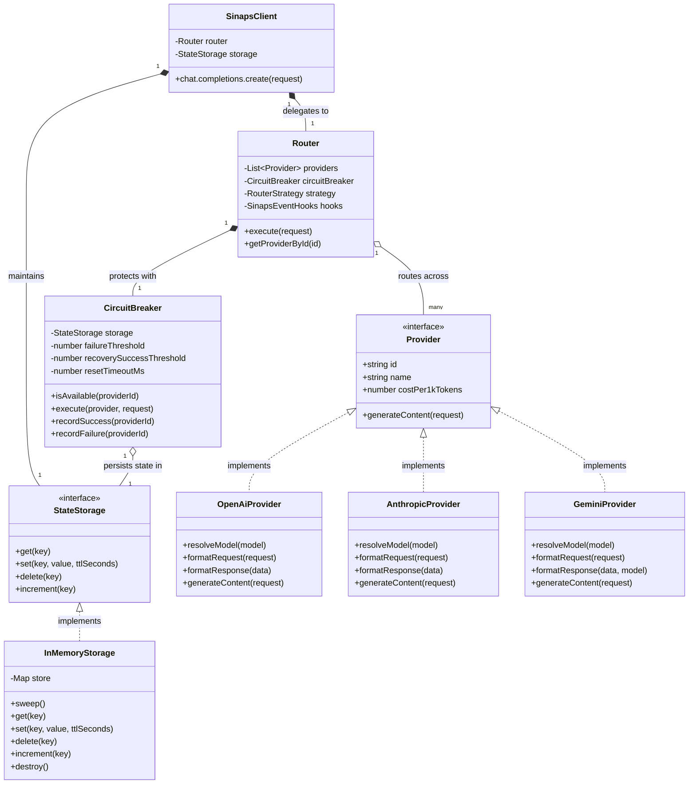

# Entity Relationship Diagram - SinapsAI (In-Memory State & Architecture)

Karena SinapsAI berjalan secara lokal sebagai SDK/Paket NPM (tanpa database eksternal), diagram ini merepresentasikan arsitektur relasi antar-komponen inti dan struktur manajemen *state in-memory*.

