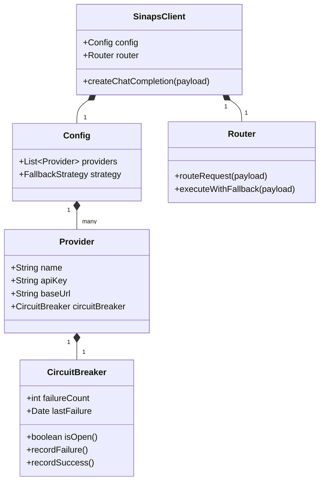

# Entity Relationship Diagram - SinapsAI (In-Memory State)

Karena SinapsAI berjalan secara lokal sebagai SDK/Paket NPM (tanpa database eksternal), diagram ini merepresentasikan struktur *in-memory state* dan arsitektur kelas inti.

